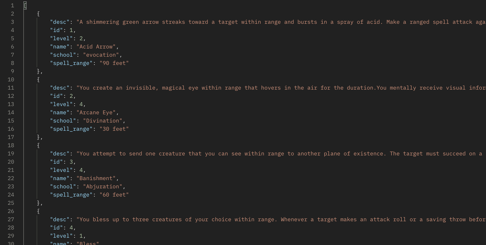
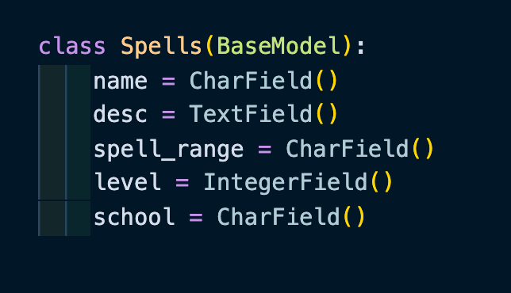

# PythonAPI

This project is to showcase building an API using Python & Flask

## Introduction

---

This project was built from the ground-up to showcase building an API using Python and Flask.

## Authorization

---

This API requires no authorization.

## Responses

---

The GET response returns a list of spells in JSON format

In order to add or edit a spell the data fields must be filled with the appropriate data type.

